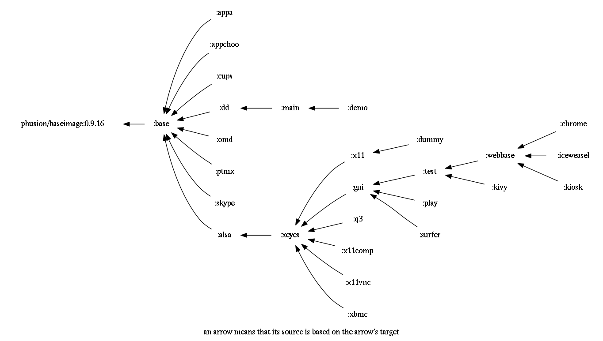

# dockapp
Application with a dynamic choice of docker containers to run .

The goal is to make the whole application as dynamic as possible (and
share images as much as possible).

## Getting Started:

1. `setup.sh`: Pull or build necessary starting images.
    Most of our images are currently available via a different tag in malex984/dockapp repository 
    (https://registry.hub.docker.com/u/malex984/dockapp/).
    Since some of them are quite big please do consider building them instead of pulling!
    Run (and change) `setup.sh` in order to pull the base image and build starting images.
    *We assume the host linux to run docker service.*
2. We are experimenting with different customization approaches:
  * `:dummy` contains `customize.sh` which performs customization to the running :dummy container, 
    these customization changes can than be detected with `docker diff` and 
    archived together (e.g. `/tmp/OGL.tgz`) for later use by `:base/setup_ogl.sh`.
  * (*obsolete*) `:up/customize.sh`: Customize each libGL-needing image (e.g. `:x11` and `:test` by default for now):
    Running `:up/customize.sh` such a host will enable one to detect known hardware or kernel modules (e.g. VirtualBox Guest Additions or NVidia driver)
    in order to localize/customize some starting images  
    under corresponding tag name (e.g. `:test.nv.340.76` or `:x11.vb.4.3.26`),
    which than will be tagged with local names (e.g. `test:latest` or `x11:latest`). 
    *We assume host system to be fully pre-configured (and all necessary kernel modules installed and loaded).*
    Therefore we avoid installing/building kernel modules inside docker container (e.g. using `dkms`).
3. `runme.sh`: Launch this dockapp application.
    The shell script `runme.sh` is supposed to be the dockapp's entry point.
    Using host docker it runs `main` (or its alteration if available) image,
    which contains a glue-together script `main.sh` that 
    now overtakes the control (!) over the host system (docker service and `/dev`).    
    Note that `main.sh` (and its helpers, e.g. `run.sh` ad `sv.sh`) is the only piece which is supposed to be aware of docker!
    The glue gives proposes a choice menu (e.g. via `:menu/menu.sh`), which exits with some return code, 
    depending on which the glue script takes some action or quits the main infinite loop.
4. Choose `X11Server` if your host was not running X11 server in order to witch the host monitor into graphical mode.
    NOTE: please don't do that while using the host monitor in text mode since at the moment 
    `menu.sh` is only suitable for console/text mode (but we are working on a GUI alternative). Better to do that via SSH.
5. Now assuming a running X11 (on host or inside a docker container) one can choose any application to run (e.g. `Test`) or Quit.


## The sequence of actions 3..5 looks approximately as follows:


## Currently we host the following images:

* `:base` serves as the common root for all my images. Thus it is the only image that needs to update & upgrade packages.
* `:dd` contains the docker cli and thus serves as a basis for `:main` which in turn pulls and launches further images.
* `:menu` image is a crude shell menu asking the user to choose an option and returns the choice via the retunr code (201, 202, 203 etc... ).
* `:appa` image run simple shell scripts saying AAA... or BBB... together with some host data.
* `:alsa` tests your audio HW using ALSA
* `:xeyes` is an image with some X11 client applications (e.g. `xeyes`).
* `:gui` contains further GUI applications based on GTK and QT. 
* `:q3` is a standalone (huge!) image with OpenArena (free version of Quake 3 Arena) which works but FPS was a bit low for me :( ALSA sound was good!
* `:skype` propriatory 32-bit application runs using apulse (emulation of pulseaudio via ALSA), it may also be able to capture video if you are lucky with your camera, its drivers and settings... It starts fine with working sound input/output but may refuse working after a while... :(
* `:iceweasel` Firefox but flash may fail. 
* `:play` contains several media players like `cmus`, `vlc`, `mplayer`, `xine`.
* `:test` for building and testing applications before creating standalone specialized images

### Services:

Some applications may need further deamons to run in background. Here is a list of server images:

* `:x11` is an Xorg/Xephyr service
* `:cups` is supposed to run CUPS server (:6631) - seems to start but has to be thoughly tested.
* `:x11vnc` is an `x11vnc` service

## The dependencies between images are as follows: 


## TODO List:

### DONE:

* `runme.sh` can use the currently running X11 of the host machine.
* `runme.sh` and `main/*.sh` correctly handle DISPLAY comming from host or from x11/xephyr container
* user can start `xephyr` in order to run our apps in a windowed mode
* 3rd party tools are currently insorporated into `:test`

### Further steps:

* switch to GUI menu (appchoo) in case of available X11
* make use of composite X11 manager (e.g. compton) and qclosebutton
* test printing via cups!
* test under Mac OS X whether the user still can use `xsocat.sh` e.g. in case of  `boot2docker`
  (e.g. following: (https://github.com/docker/docker/issues/8710), and
  makeing sure to fix your firewall, and X11 settings to accept incoming connections)
* make a nice logo for the app (e.g. whales following each other while being driven by BASH :) )


## Problems:

### X11 would not create a new terminal with the following error message:

```
xterm: Error 32, errno 2: No such file or directory
Reason: get_pty: not enough ptys
```

It seems that somebody clears permissions on `/dev/pts/ptmx` in the
course of the docker mounting `/dev` or using it by containers... 

Since this problem happens rarely it may be related to unexpected "docker rm -vf" for a running container with allocated pty.
Also the following may be related: 
* https://github.com/docker/docker/issues/4605
* https://github.com/docker/docker/pull/4656

Quick Fix is `sudo chmod a+rw /dev/pts/ptmx`

NOTE: what about `/dev/ptmx`?


### "operation not supported" error when trying to RUN something during docker image building

According to http://stackoverflow.com/a/29546560 : if your machine had
a kernel update but you didn't restart yet then docker freaks out like
that.


## Docker shortcuts:
### Cleanup dangling images
```
docker rmi $(docker images -f "dangling=true" -q)
```

### Cleanup dockapp-related images:
```
docker images | grep malex984/dockapp | awk ' { print $1 ":" $2 } ' | xargs docker rmi -f 
docker rmi -f x11 test dummy
```

### Cleanup all containers:
```
docker ps -aq | xargs docker rm -fv
```
