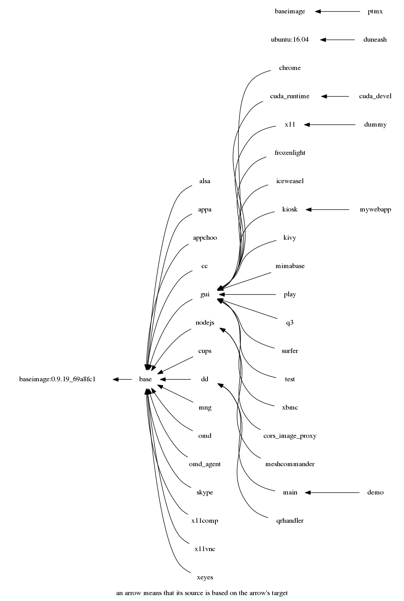

# Docker images for Hilbert

Applications are within docker images to be pulled and run by Hilbert.

Current top folders | Folder description
------------------- | -----------
`helpers` | shell scripts shared between images
`images`  | our base and application's images

## All current images with dependencies are as follows: 


## Currently we provide the following base images:

Image | description
----- | -----------
`hilbert/baseimage`    [](https://microbadger.com/images/hilbert/baseimage "Get your own image badge on microbadger.com") [](https://microbadger.com/images/hilbert/baseimage "Get your own version badge on microbadger.com") | modified `phusion/baseimage` reverted to Ubuntu 14.04 + without embedded SSH server
`hilbert/base`         [](https://microbadger.com/images/hilbert/base "Get your own image badge on microbadger.com") [](https://microbadger.com/images/hilbert/base "Get your own version badge on microbadger.com") | generic base for most of Hilbert images. Thus it is the only image that will upgrade all previously added packages
`hilbert/dd`           [](https://microbadger.com/images/hilbert/dd "Get your own image badge on microbadger.com") [](https://microbadger.com/images/hilbert/dd "Get your own version badge on microbadger.com") | contains the docker cli and thus serves as a basis for `hilbert/omd_agent` and other images requiring interaction with the native docker engine
`hilbert/nodejs`       [](https://microbadger.com/images/hilbert/nodejs "Get your own image badge on microbadger.com") [](https://microbadger.com/images/hilbert/nodejs "Get your own version badge on microbadger.com") | contains basic `Node JS 4`
`hilbert/gui`          [](https://microbadger.com/images/hilbert/gui "Get your own image badge on microbadger.com") [](https://microbadger.com/images/hilbert/gui "Get your own version badge on microbadger.com") | serves as a base for all GUI/3D-related images (with dbus, multi-touch and possible NVidia support)
`hilbert/cuda_runtime` [](https://microbadger.com/images/hilbert/cuda_runtime "Get your own image badge on microbadger.com") [](https://microbadger.com/images/hilbert/cuda_runtime "Get your own version badge on microbadger.com") |serves as a base for all GUI/3D/CUDA-related images (with dbus and multi-touch support)
`hilbert/kivy`         [](https://microbadger.com/images/hilbert/kivy "Get your own image badge on microbadger.com") [](https://microbadger.com/images/hilbert/kivy "Get your own version badge on microbadger.com") | may be used as a base for all kivy-related images (gui + python-kivy)
`hilbert/kiosk`        [](https://microbadger.com/images/hilbert/kiosk "Get your own image badge on microbadger.com") [](https://microbadger.com/images/hilbert/kiosk "Get your own version badge on microbadger.com") | Kiosk-mode web-wrowser using Electron (based on Chromium). Can be used as a basis for WebBrowser-related images (as well as `hilbert/gui`, `hilbert/chrome` or `hilbert/iceweasel`). See `hilbert/mywebapp`.

### Current services/applications-specific images:

Image | description
----- | -----------
`hilbert/chrome` | Google Chrome & Chromium & Opera
`hilbert/iceweasel` | Firefox & Iceweasel
`hilbert/x11vnc` | `x11vnc` as a service
`hilbert/x11comp` | composing window manager (xcompmgr or compton) as a service
`hilbert/omd` | containes pre-cofigured OMD service instance
`hilbert/omd_agent` | containes pre-cofigured OMD/Check_MK Agent (with our addition: `check_hilbert.sh`) and HeartBeat server instance, see `hilbert/hilbert-heartbeat`
`hilbert/appa` | image run simple shell scripts saying AAA... or BBB... and sending Heartbeat
`hilbert/mng` | Hilbert Dashboard UI (including Hilbert server tool)
`hilbert/qrhandler` | is a service to exclusively handle QR Reader and take some action upon each new scanned code (show message & takes screenshot)
`hilbert/ptmx` | service to try to workarouind the docker problem of permissions to /dev/pts/ptmx
`hilbert/surfer` | Application: SURFER (1.5.0). Example for installing a .deb package
`hilbert/qrhandler` | prototype that can grab X11 input device (keyboard) and take screenshots
`hilbert/play` | contains several media players like `cmus`, `vlc`, `mplayer`, `xine`
`hilbert/alsa` | scripts for testing audio HW using ALSA
`hilbert/xeyes` | a demo image with simplest X11 client applications (e.g. `xeyes`)
`hilbert/appchoo` | image is a crude shell menu asking the user to choose an option and returns the choice via the return code (201, 202, 203 etc... ). Depending on `MENU_TRY` it can be either GUI or TEXT style.
`hilbert/q3` | is a standalone (huge!) image with OpenArena (free version of Quake 3 Arena) which works but FPS was a bit low for me :( ALSA sound was good!
`hilbert/skype` | propriatory 32-bit application runs using apulse (emulation of pulseaudio via ALSA), it may also be able to capture video if you are lucky with your camera, its drivers and settings... It starts fine with working sound input/output but may refuse working after a while... :(
`hilbert/cups` | is supposed to run CUPS server (:6631) - seems to start but has to be thoughly tested.
`hilbert/xbmc` | Application: Kodi media center
`hilbert/demo` | legacy prototype Demo: provides a choice menu with a selection of sample GUI application
`hilbert/main` | legacy technical Demo
`hilbert/x11` | is a basis for Xorg/Xephyr service
`hilbert/dummy` | DEPRECATED! Was used for running X11 and HW customization for GPU (OpenGL-library). Please use `nvidia-docker` instead.
`hilbert/test` | applications and scripts for testing HW & GPU
`hilbert/cuda_devel` | [](https://microbadger.com/images/hilbert/cuda_devel "Get your own image badge on microbadger.com") [](https://microbadger.com/images/hilbert/cuda_devel "Get your own version badge on microbadger.com") Base for OpenGL+CUDA development

NOTE: Some applications may need further services (applications) to run in background

# Dockerization within this framework (cheatsheet?) - what to run and how?

## General notes

1. Each image must reside in an individual sub-folder. Create one named after your image (lowercase, only [a-z0-9] characters should be
used).
2. Copy some simple existing `Dockerfile` (e.g. from `/chrome/`) and change it according to your needs (see below).
3. Same with `Makefile` and `docker-compose.yml`

## Using `Makefile`:

* `make pull` will try to pull the desired base image
* `make` will try to (re-)build your image (currently no build arguments are supported)
* `make check` try to run the default command withing your image
* `make prune` will clean-up dangling docker images (left after rebuilding images)

NOTE: `make` needs to be installed only on your development host.

## What to run: specify building your of image with `Dockerfile`

For example see `chrome/Dockerfile`.

0. Specify your contact email via `MAINTAINER`

1. Choose a proper base image among already existing (see above) - `FROM`

NOTE: currently we base our images on top of ~~`phusion/baseimage:0.9.18`~~ `hilbert/baseimage`
which is based on `ubuntu:14.04` and contains a usefull launcher
wrapper (`/sbin/my_init`).

NOTE: we share docker images as much as possible by choosing closest possible base image to start new image from.

2. Install additional SW packages (e.g. see `chrome/Dockerfile`) - `RUN`

NOTE: one may also need to add keys and packages repositories .

NOTE: it may be necessary to update repository caches before
installing some packages.  Also do not forget to clean-up afterwards.

NOTE: The best way to install something is `RUN update.sh && install.sh YOUR_PACKAGE && clean.sh`

3. Add necessary local resources and online resources into your image - `ADD` or `COPY`


NOTE: use `ADD URL_TO_FILE FILE_NAME_IN_IMAGE` to add something from
network in build-time. 

NOTE: use `COPY local_file1 local_file2 ... PATH_IN_IMAGE/` to copy
local files (located alongside with your `Dockerfile`) into the image
(with owner: `root` and the same file permissions).

4. Run any initial configuration (post installation) actions - `RUN`

NOTE: only previouslly installed/added (into the image) executables
can be run.

### Building notes:
* one can have build arguments but we do not use them.
* one can set environment variables within `Dockerfile` and later
override them in run-time.
* exposing network ports may be done either statically inside
`Dockerfile` or dynammically in run-time. 
* Same goes to specification of default command / entry-point script/application and labels.

NOTE: no need to put run-time specifications inside `Dockerfile` (e.g. `EXPOSE`, `PORT`, `ENTRYPOINT`, `CMD` etc.) as they will be overrriden in run-time via `docker-composer`.

TODO: create `docker-compose.yml` for all images

5. `make` to build the image

## Run-time: how to run Your Image - `Makefile` and `docker-compose.yml`

What can be specified in run-time:

* your docker image
* default command
* environment variables to be passed to executed command
* exposed (and redirected) ports
* mounted devices
* mounted volumes (local and docker's logical)
* restart policy: "on-failure:5" (e.g. see https://blog.codeship.com/ensuring-containers-are-always-running-with-dockers-restart-policy/)
* labels attached to running container (e.g. `is_top_app=0` for BG service and `is_top_app=1` for top-front GUI application)
* working directory

* mode of execution: not `privileged` in most cases

See for example `mng/docker-compose.yml` or `mng/Makefile`


## **Old** testing procedure:

1. `setup.sh`: Pull or build necessary starting images (`hilbert/*`).
    Previously our images were available via a different tag in `malex984/dockapp` repository 
    (https://registry.hub.docker.com/u/malex984/dockapp/).
    Run (and change) `setup.sh` in order to pull the base image and build starting images.
    *We assume the host linux to run docker service.*
2. We are experimenting with different customization approaches:
  * `hilbert/dummy` contains `customize.sh` which performs customization to the running :dummy container, 
    these customization changes can than be detected with `docker diff` and 
    archived together (e.g. `/tmp/OGL.tgz`) for later use by `hilbert/base/setup_ogl.sh`.
  * (*obsolete*) ~~`:up/customize.sh`: Customize each libGL-needing image (e.g. `:x11` and `:test` by default for now):
    Running `:up/customize.sh` such a host will enable one to detect known hardware or kernel modules (e.g. VirtualBox Guest Additions or NVidia driver)
    in order to localize/customize some starting images  
    under corresponding tag name (e.g. `:test.nv.340.76` or `:x11.vb.4.3.26`),
    which than will be tagged with local names (e.g. `test:latest` or `x11:latest`). 
    *We assume host system to be fully pre-configured (and all necessary kernel modules installed and loaded).*
    Therefore we avoid installing/building kernel modules inside docker container (e.g. using `dkms`).~~
3. `runme.sh`: Launch demo prototype application.
    The shell script `runme.sh` is supposed to be the demo entry point.
    Using host docker it runs `main` (or its alteration if available) image,
    which contains a glue-together script `main.sh` that 
    now overtakes the control (!) over the host system (docker service and `/dev`).    
    Note that `main.sh` (and its helpers, e.g. `run.sh` ad `sv.sh`) is the only piece which is supposed to be aware of docker!
    The glue gives proposes a choice menu (e.g. via `hilbert/menu/menu.sh`), which exits with some return code, 
    depending on which the glue script takes some action or quits the main infinite loop.
4. Choose `X11Server` if your host was not running X11 server in order to witch the host monitor into graphical mode.
    NOTE: please don't do that while using the host monitor in text mode since at the moment 
    `menu.sh` is only suitable for console/text mode (but we are working on a GUI alternative). Better to do that via SSH.
5. Now assuming a running X11 (on host or inside a docker container) one can choose any application to run (e.g. `Test`) or Quit.


## The sequence of actions 3..5 looks approximately as follows:


## Problems:

### X11 would not create a new terminal with the following error message:

```
xterm: Error 32, errno 2: No such file or directory
Reason: get_pty: not enough ptys
```

It seems that somebody clears permissions on `/dev/pts/ptmx` in the
course of the docker mounting `/dev` or using it by containers... 

Since this problem happens rarely it may be related to unexpected "docker rm -vf" for a running container with allocated pty.
Also the following may be related: 
* https://github.com/docker/docker/issues/4605
* https://github.com/docker/docker/pull/4656

Quick Fix is `sudo chmod a+rw /dev/pts/ptmx`

NOTE: what about `/dev/ptmx`?


### "operation not supported" error when trying to RUN something during docker image building

According to http://stackoverflow.com/a/29546560 : if your machine had
a kernel update but you didn't restart yet then docker freaks out like
that.


## Docker shortcuts:
### Cleanup dangling images
```
docker rmi $(docker images -f "dangling=true" -q)
```

### Cleanup Hilbert-related images:
```
docker images | grep malex984/dockapp | awk ' { print $1 ":" $2 } ' | xargs docker rmi -f # old 
docker images | grep 'hilbert/' | awk ' { print $1 ":" $2 } ' | xargs docker rmi -f
docker rmi -f x11 test dummy
```

### Cleanup all containers:
```
docker ps -aq | xargs docker rm -fv
```

## License
This project is licensed under the [Apache v2 license](LICENSE). See also [Notice](NOTICE).
